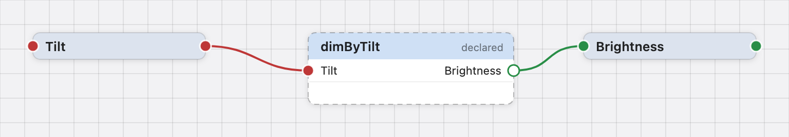

# Your first behavior

**Goal.** A desk lamp whose brightness follows how far its head is tilted:
upright is off, flat is full. By the end you will have a design with two
concepts, three relationships, one timing domain and one physical output —
checked, saved, and ready to [simulate](first-simulation.md).

**Time.** About twenty minutes.

You will meet each idea when the design needs it. The
[Concepts](../concepts/concepts.md) pages explain each one properly afterwards.

## 1. Create a project

1. Launch Studio ([Install and launch](install-and-launch.md)).
2. Click **New Project…**, choose a location and name the folder `lamp`.

The workspace opens on the **Design** page: a sidebar on the left, an empty
canvas in the middle, an inspector on the right, a status line and the page bar
along the bottom. The canvas says what to do first: add a concept from the
sidebar.

## 2. Add the two concepts

A **concept** is a value with a meaning. The lamp has two: how far it is tilted,
and how bright it is.

1. In the sidebar's **Project** tab, click **+** next to _Concepts_.
2. In the _New concept_ sheet: Name `Tilt`. Under _Value_ choose **Quantity**,
   and for the unit choose **angle** (the symbol `rad` appears in its own
   column). Click **Create**.
3. Again **+** next to _Concepts_: Name `Brightness`, **Quantity**, unit **no
   unit**. Click **Create**.

Each concept is one row on the canvas with a round socket at each end. The round
shape means _quantity_; the colour is the concept's own and will appear wherever
_that_ concept is used. Brightness is a quantity with no unit: a level from 0
to 1.

> The sheet previews the row as you type. A hollow ring instead of a filled
> socket would mean the value form is not chosen yet — that is allowed, and the
> guide comes back to it.

**What you made.** Two named meanings. Nothing about numbers yet. The sidebar's
**Library** tab offers ready-made concepts (_Tilt_ and _Brightness_ are both
there); dragging one onto the canvas is the same as filling in the sheet.

## 3. Add the relationship

A **relationship** says how one concept follows from others.

1. Click **+** next to _Mappings_ in the sidebar (the sheet is titled _New
   mapping_; the guide says _relationship_ — they are the same thing).
2. Name `dimByTilt`. Under _Reads_, switch on **Tilt**. Under _Produces_, choose
   **Brightness**. Click **Create**.

A node appears with one input socket (Tilt, on the left) and one output socket
(Brightness, on the right). It is drawn **dashed** with the word _declared_ in
its header: the relationship exists and has a signature, but no formula yet.
That is not an error. You could stop here, save, and come back tomorrow.



_A declared relationship: dashed outline and the word declared in its header.
Its output socket is hollow: no value comes out of a rule until a value applies
it._

## 4. Write the formula

1. Click the `dimByTilt` node. The inspector shows it.
2. In the **Relationship** section, the editor opens in its **Formula** view: an
   empty slot, `?`, and the words _produces a Brightness_. Click the slot. Under
   it, _References_ lists **Tilt** — click it. The slot becomes `Tilt`.
3. Click `Tilt` and press **÷**. The formula reads `Tilt ÷ ?`, and the new slot
   is selected: _Expected: an angle, because an angle ÷ an angle = a
   dimensionless quantity._
4. In the number entry type `90`, choose **deg** from the unit pop-up (only
   angle units are offered), and press Return. The formula reads `Tilt ÷ 90 deg`
   and the line under the field says _Valid definition_.

   If you would rather type, switch to **Text** and write it as text:

   ```text
   Tilt / 90 deg
   ```

   Both views edit the same formula. Press **⌘↩** or click **Add definition**.


_The Formula view with the denominator slot selected: the quotient drawn as a
fraction; the compiler says the slot expects an angle and why, and offers a
number with the angle units, the references that fit and the equations whose
result fits._

The node now shows its formula in the body and is drawn solid.

**What you made.** A rule: brightness is the tilt divided by ninety degrees. Try
it in the **Text** view: change `90 deg` to `90 s` and watch the line under the
field turn red: it says what Brightness is and what the formula produces instead
— an angle divided by a time is not a plain number. Put `deg` back. Every
formula is checked this way, for units and for meaning, as you type or as you
assemble it — and nothing is saved to the design until you press _Add
definition_.


_The formula field with a draft that does not check: the red verdict line says
what Brightness is and what the formula produces instead._

> In the Text view, **⌃Space** opens completion: the names you can use here
> (_Tilt_), units after a number, keywords. Hovering a name for a moment shows
> what it is. The Formula view asks for nothing: each slot lists what fits.

## 5. Bring the tilt in from the environment

`dimByTilt` is a rule, not a value: it needs a tilt to work on. Where does the
tilt come from? From the environment — a sensor, outside the design. In BDL a
value the environment provides is a **Source**: a relationship that **reads
nothing**, produces the concept, and has **no formula**.

1. **+** next to _Mappings_: Name `tilt`, read nothing, produce **Tilt**.
   Create. (Right-click the canvas → **Add Source ▸** → _New Source…_ makes the
   same thing over the concept you choose there — Tilt — and can make a new
   concept with it.)

The node says _Source_ in its header, with a bar down its left edge and no input
socket. It is not dashed: nothing is missing. In the simulator you will type its
value; on a device the sensor will provide it.

## 6. Compute the lamp's brightness

The value the lamp actually shows is `dimByTilt` applied to `tilt`. That is
again a relationship that reads nothing and produces Brightness — this time with
a formula.

1. **+** next to _Mappings_: Name `brightness`, read nothing, produce
   **Brightness**. Create.
2. Select it and enter the formula `dimByTilt(tilt)`. _Add definition._

Completion offers `dimByTilt(` because it is a relationship with an input, and
`tilt` because it is a value. The formula field is the only place where
relationships are combined; links on the canvas show _which concepts_ a
relationship reads, not the arithmetic.

**What you made.** Three relationships: a Source (`tilt`), a rule (`dimByTilt`)
and a computed value (`brightness`). The status line at the bottom counts them.

## 7. Give the values a rhythm

A value that comes from outside has a rhythm: the sensor reports every so often.
In BDL that rhythm is a named **timing domain**, and every value that updates on
its own belongs to one.

1. **+** next to _Timing domains_: name it `interaction`. Create.
2. Select `tilt`. In the inspector's **Timing** section, set **Updates in** to
   _interaction_.
3. Select `brightness` and do the same.

`dimByTilt` stays on _Any timing domain_: it is a pure rule and takes the rhythm
of whatever applies it. The domain's name appears quietly at the right edge of
the two nodes.

**What you made.** A design in which "when does this update" is an explicit
decision. A domain is a name, not a rate — how often _interaction_ ticks is
chosen when you simulate or deploy, not here.

## 8. Add the light

Brightness is a value inside the design. The lamp itself is a **physical
output**: the place where a value leaves the design for the world.

1. **+** next to _Outputs_. In the _New output_ sheet: Name `light`, **Accepts**
   Brightness, **Updates in** interaction, **Required** on. Create.

A sink node appears at the right edge of the canvas, drawn dashed: it has a
domain but nothing drives it yet. The status line says _outputs incomplete_.

1. Drag from `brightness`'s output socket onto the sink's socket. (Or select the
   output and pick `brightness` in the **Connect** pop-up of its inspector; the
   pop-up marks relationships that _have inputs_, which cannot drive an output.)

The sink becomes solid. Only a relationship that _reads nothing_ and produces
the accepted concept in the same domain can drive an output. `brightness`
qualifies; connecting `dimByTilt` instead would be accepted as an edit and then
reported under the output as a connection that does not fit.

**What you made.** A complete design. The status line no longer says _outputs
incomplete_, and nothing is _not yet defined_: `tilt`, the Source, is meant to
stay without a formula, and the line counts it as _1 source_. Press **⌘S** to
save.

## What you have


_The finished lamp: the Source tilt, the rule dimByTilt, the value brightness,
and the driven light._

| Object         | Kind                                   | Formula           | Updates in    |
| -------------- | -------------------------------------- | ----------------- | ------------- |
| **Tilt**       | concept, an angle                      |                   |               |
| **Brightness** | concept, a plain number                |                   |               |
| **tilt**       | relationship reading nothing: a Source | _none_            | _interaction_ |
| **dimByTilt**  | relationship reading Tilt: a rule      | `Tilt / 90 deg`   | any           |
| **brightness** | relationship reading nothing: a value  | `dimByTilt(tilt)` | _interaction_ |
| **light**      | physical output driven by brightness   |                   | _interaction_ |

The design is _executable_: every relationship the output depends on is defined
or is a Source, checks, has a rhythm, and the output has exactly one driver.

## If something does not work

- **The formula line is red.** Read it: it names the problem in terms of your
  concepts ("this divides an angle by a time"). See
  [Types, units and concepts](../troubleshooting/type-and-concept-errors.md).
- **`brightness` will not connect to the output.** Check its _Updates in_
  matches the output's, and that it reads nothing. See
  [Connections](../troubleshooting/connection-errors.md).
- **The status line says _N definitions not added_.** A formula is typed but not
  added; select the node and press _Add definition_ or _Revert_.
- **Nothing checks and the bottom line says _Compiler not connected_.** See
  [Install and launch](install-and-launch.md).

## Next

[Your first simulation](first-simulation.md) — tilt the lamp and watch the
brightness.
