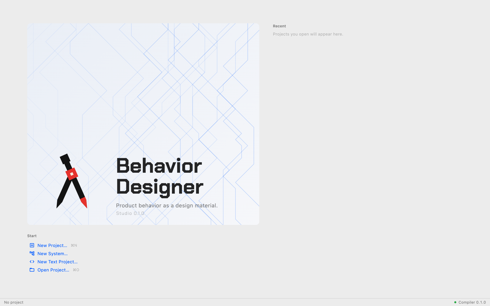

# Install and launch

Behavior Designer is built from source. There is no installer or packaged
download yet. The build produces two things: the Studio app and the compiler
service it talks to (`bdld`), which Studio starts for you.

## What you need

| Tool    | Version                                                | Notes                                                  |
| ------- | ------------------------------------------------------ | ------------------------------------------------------ |
| Rust    | 1.89 — pinned by the repository, installed by `rustup` | builds the compiler service                            |
| Flutter | 3.47                                                   | builds Studio; on macOS, `brew install --cask flutter` |
| `just`  | any                                                    | the task runner the repository uses                    |

macOS and Windows are the supported desktops. Linux builds as a by-product but
is not exercised.

## Build and run

From the repository root:

```bash
just studio
```

This builds `bdld` and starts Studio pointed at it. The first build takes
several minutes; later ones are quick.

**Run it from Terminal or a Finder-launched shell**, not from a terminal
embedded in another application. macOS refuses to show file dialogs to apps
launched from sandboxed hosts; Studio detects that and offers typed paths
instead (_Open by path…_, _New at path…_), but the native dialogs are the
intended way.

## What you see first

Studio opens on the **project manager**: the wordmark on the left with _Start_
actions under it, _Recent_ projects on the right.



_The project manager: Start actions on the left, Recent on the right._

| Action            | What it does                                                                      |
| ----------------- | --------------------------------------------------------------------------------- |
| **New Project…**  | asks for a folder name and location, creates a project there, opens the workspace |
| **Open Project…** | opens an existing project folder                                                  |
| a _Recent_ row    | reopens that project; rows whose folder is gone are greyed _not found_            |

A **project** is a folder. Everything in it is saved as plain files
([Project files](../reference/project-files.md)): the design as `.bdl` text you
can also edit in a code editor, and the canvas layout beside it. There is one
kind of project; behavior groups, components and instances
([System projects](../studio/system-projects.md)) and the **Code** view
([Design, Code and Split](../studio/code-view.md)) are available in every one.

The bottom line of the window shows the connection to the compiler service:
_Compiler 0.1.0_ when connected, _Connecting to the compiler_ while it starts,
_Compiler not connected_ if it could not. Studio does nothing semantic on its
own — every check, value and verdict in the guide comes from that service — so
this line is the first thing to look at if the app seems inert.

## Try the finished example

The repository ships one complete project, `examples/smart_lamp`. _Open
Project…_ → choose that folder. It is the lamp the tutorials build, with an
ambient-light sensor added: two inputs, three relationships, one required
output, one PWM device. You can walk its Design, Simulate and Deploy pages
before building your own.

## Next

[Your first behavior](first-behavior.md).
