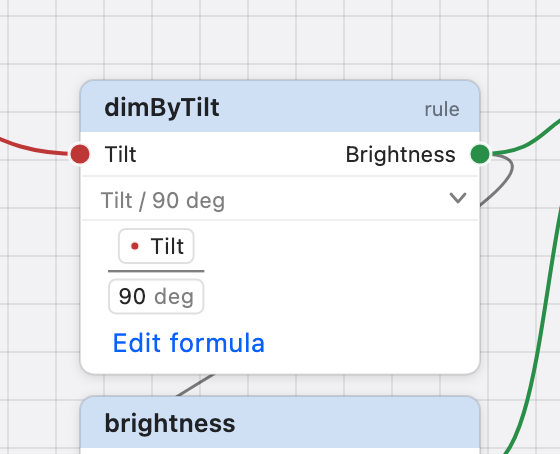

# Canvas

The canvas is the Design page's centre: a picture of the design's structure.
Everything on it means something, and each visual channel means one thing only.

## What the marks mean

| You see                                                              | It means                                                                                                                                                                                                           |
| -------------------------------------------------------------------- | ------------------------------------------------------------------------------------------------------------------------------------------------------------------------------------------------------------------ |
| **socket colour**                                                    | _which concept_ — every concept has its own hue, the same everywhere it appears                                                                                                                                    |
| **socket shape**                                                     | the concept's _value form_: ○ quantity, ◇ on / off, □ count; a **hollow ring** while the value form is _decide later_                                                                                              |
| **a link in a concept's colour, socket to socket**                   | the signature: _this relationship reads that concept_ (concept → relationship input), _this relationship produces that concept_ (relationship → concept), or _this value drives that output_ (relationship → sink) |
| **a thin grey link ending at a formula line**                        | a reference: _this formula names that relationship_ — a value applying a rule, or naming a value or a Source. Nothing can be dragged to or from it; the formula is edited in the inspector                         |
| **dashed outline**                                                   | _declared_: a relationship that reads something and has no formula; an output without a driver or without a domain                                                                                                 |
| **a bar down a node's left edge, an entry arrow, the word _Source_** | a **Source**: a value the environment provides — a relationship that reads nothing and has no formula. Nothing is missing                                                                                          |
| **a red mark at the formula line**                                   | the formula does not check — _wrong now_, never _not yet_                                                                                                                                                          |
| **the word _declared_, _contested_, _ill-formed_, _no domain_**      | the one state word a node may carry, only while that state holds (an output that must be driven says _required_ meanwhile; a Source says _Source_)                                                                 |
| **the word _rule_**                                                  | a relationship that reads something — a function; it has no value of its own until a value's formula applies it. Shown when no state word takes the slot                                                           |
| **a small name at a node's right edge**                              | its timing domain                                                                                                                                                                                                  |
| **the accent colour**                                                | selection — and nothing else                                                                                                                                                                                       |

Position, size and the direction of links carry **no meaning**. Data is drawn
left to right for readability. Coloured links show the signature and grey links
show what depends on what; neither shows the order in which anything runs, and
there is no node per operator — arithmetic lives in the formula field.

## The nodes

![Concept rows Tilt and Brightness with a round socket at each end; relationship nodes with a name header, one input socket per concept read on the left, one output socket on the right and the formula in the body; dimByTilt, with the word rule in its header, outlined in the accent colour because it is selected; the Source tilt with a bar at its left edge, an entry arrow and the word Source in its header and no input socket; brightness with no input socket and two thin grey links arriving at its formula line from the output sockets of tilt and dimByTilt; the light sink at the right with the word required in its header, a single input socket and a bar at its right edge; tilt, brightness and the output carry the domain name interaction at their right edge.](../assets/studio/node-anatomy.png)

_Node anatomy on the tilt lamp: concept rows, relationship nodes (dimByTilt
selected), and the light sink._

A **concept** is one row: its name, an input socket on the left (something
produces this concept) and an output socket on the right (relationships read it
from here). Both sockets carry the concept's colour and shape.

A **relationship** is a box: a header with the name and, while it applies, the
one state word (_declared_ on a relationship that reads something and has no
formula yet); one input socket per concept it reads, on the left, each labelled
with the concept; one output socket on the right, labelled with the concept it
produces; and the formula on the line below, with the timing domain's name at
the right edge when the relationship has one. A relationship with a formula
carries a small chevron at that line: click it (or **Show Formula** in its menu)
and the node unfolds to show the formula the way the
[Formula editor](formula-editor.md) draws it — a fraction, a branch, the units —
with its first finding beneath and **Edit formula**, which opens the inspector.
The unfolded formula is for reading: clicking it selects the node and changes
nothing. Which nodes are unfolded is not saved with the project.

_dimByTilt unfolded: the chevron at its formula line turned down, and the saved
formula Tilt / 90 deg drawn as a fraction inside the node, with Edit formula
beneath._

The box tells the three shapes apart without the formula. A relationship that
reads something — `dimByTilt` above — is a **rule**: it has input sockets and,
when nothing else needs the header's word, the word _rule_. It is a function;
the design computes nothing with it until a value's formula applies it. A
relationship that reads nothing and has a formula — `brightness` — is a
**value**: no input sockets, no word, and its formula names the values and rules
it depends on. Each of those is joined to it by a **reference link**: a thin
grey line from that relationship's output socket to the left end of
`brightness`'s formula line. Reference links are the design's dependency, read
off the compiler's analysis of the formula; they appear when the analysis
arrives and cannot be dragged — change the formula to change them. A rule that
no formula applies has no reference link leaving it into any formula line.

A **Source** is a relationship that reads nothing and has no formula — `tilt`
above: the environment provides its value, once per activation. It is drawn with
the word _Source_ in the header, an entry arrow before its name, a bar down its
**left** edge (the environment side; nothing in the design feeds it), one output
socket and no input socket. It is not dashed and not _declared_: nothing is
missing. What provides the value on a real product — a sensor, a button, an
analog line — is a deployment matter, not a mark on the canvas; give the Source
a formula and it becomes an ordinary relationship computed inside the design.

A **physical output** is a sink: a tinted header with its name and a word at the
right — _required_ for an output the design must drive before it is complete, or
the state that overrides it (_no domain_, _contested_, _ill-formed_); one input
socket labelled with the concept it accepts; the timing domain at the right
edge; and a bar down its right side — nothing flows out of it.

The selected node (`dimByTilt` above) is outlined in the accent colour; nothing
else on the canvas uses that colour.

A project that composes components also shows **instance nodes** (one row per
port, the component's name in the body) and **behavior regions** or collapsed
**behavior boxes**; see [System projects](system-projects.md).

Every node has a place. A node you did not place — one made in the Code view, in
a code editor, or by an older project's first open — is placed for you: in the
column of its kind (concepts left, relationships in the middle, outputs right),
beside what it reads or produces, below anything already there. Nothing you
placed moves; drag it where you like ([Design, Code and Split](code-view.md)).

## Selecting

The canvas selects the way desktop CAD tools do.

| Do                                          | Result                                                                                                                                                |
| ------------------------------------------- | ----------------------------------------------------------------------------------------------------------------------------------------------------- |
| click a node                                | select it alone (the inspector follows); clicking a node that is already part of a selection keeps the selection and makes it the active one          |
| click empty canvas                          | clear the selection                                                                                                                                   |
| ⌘-click (Ctrl-click on Windows and Linux)   | add a node to the selection, or remove one that is in it                                                                                              |
| ⇧-click                                     | select the chain of connections from the active node to this one — when there is exactly one; otherwise the node is added on its own                  |
| drag on empty canvas from **left to right** | a **window**: every node wholly inside the rectangle is selected (solid outline)                                                                      |
| drag on empty canvas from **right to left** | a **crossing**: every node inside _or touched_ by the rectangle is selected (dashed outline); up or down makes no difference                          |
| ⌘-drag / ⇧-drag a rectangle                 | add the rectangle's nodes to the selection / remove them from it (a `+` or `−` beside the pointer); the nodes show what will happen before you let go |
| ⌘A                                          | select every node in view                                                                                                                             |
| Esc                                         | cancel what is in progress — a rectangle, a move, a link; with nothing in progress, clear the selection                                               |

The selected nodes are outlined in the accent colour; when several are selected
the _active_ one — the one you clicked last, the one the inspector shows first —
wears a second ring around it. The Project sidebar selects the same way: a click
for one row, ⌘-click to add or remove, ⇧-click for every row between the active
one and it.

## Moving and looking around

| Do                                                          | Result                                                                                                           |
| ----------------------------------------------------------- | ---------------------------------------------------------------------------------------------------------------- |
| drag a selected node                                        | the whole selection moves together, keeping its spacing; released, the positions are saved (not a design change) |
| drag an unselected node                                     | it becomes the selection and moves                                                                               |
| drag a behavior's title band                                | its relationships move                                                                                           |
| ← → ↑ ↓                                                     | nudge the selection one grid step; with ⇧, one point                                                             |
| middle-button drag, Space + drag, two fingers on a trackpad | pan                                                                                                              |
| scroll wheel, pinch, ⌘ + two fingers                        | zoom about the pointer                                                                                           |
| Home, or ⌘0                                                 | frame the whole design                                                                                           |

## Connecting

| Do                                                                    | Result                                                                                                                                                     |
| --------------------------------------------------------------------- | ---------------------------------------------------------------------------------------------------------------------------------------------------------- |
| drag from an output socket to an input socket                         | make a link; while dragging, every socket that can accept it shows a halo, an incompatible socket the forbidden cursor                                     |
| drag a **concept**'s output socket onto an **output** that accepts it | connect the relationship that provides the concept as the output's driver (below)                                                                          |
| drag from a connected input socket away, release on empty canvas      | disconnect                                                                                                                                                 |
| drop a dragged link on empty canvas                                   | nothing (no node is created)                                                                                                                               |
| ⌫ / Delete                                                            | delete the selection — several objects at once; if one of them is still used by something outside the selection, nothing is deleted and a banner says what |
| double-click a concept or relationship node                           | rename in place (an output is renamed in the inspector; an instance opens its source)                                                                      |
| right-click, or Control-click                                         | the context menu (below)                                                                                                                                   |
| drag a row from the Library tab onto the canvas                       | open the concept sheet for that category; the concept you name lands at the drop point                                                                     |

**Driving an output from its concept.** An output is driven by a relationship —
a value or a Source that produces exactly what the output accepts, in the
output's timing domain — and never by a concept itself. You do not have to find
that relationship first: drag the concept's output socket onto the output. When
one relationship can drive it, it is connected at once. When several can, a
small menu names them (_Drive with brightness_, _Drive with dimmer_) and you
choose; nothing is chosen for you. When none can, the menu says so — _Servo
accepts ServoPosition, but no current relationship can drive it_ — and offers
the output in the inspector. An output that is already driven is offered a
replacement (_Replace lifted with rest_): the old driver lets go, then the new
one connects, and the output never has two drivers in between. The edge on the
canvas still runs from the driving relationship — that is what drives the output
— and the output's context menu names it (_Show Driver: brightness_).

<!-- figure F7: a link in mid-drag with the halo — pending, see SCREENSHOT_PLAN.md -->

## The context menu

The menu is about what you right-clicked, and only that. While it is open the
canvas waits: nothing behind the menu moves, scrolls or lights up; the first
click outside closes it and does nothing else; a right-click somewhere else
moves it there. Use ↑ ↓ ⏎ and Esc as in any menu.

On **empty canvas**: **Add Concept ▸** — _Recent_, the four kinds of value (_On
/ off_, _Count_, _Level_, _Decide later_), _Quantities ▸_ (_Angle_, _Length_,
…), _More…_ (which opens the Library tab), each opening the
[concept sheet](library.md#creating-a-concept) where you name the concept; **Add
Source ▸** — _New source…_, opening the [Source sheet](library.md#sources),
where you choose the concept the Source provides — an existing one, or a new one
made with it; **Add Instance ▸** _component_ and **New Behavior Group**; then
**Select All** and **Frame All**.

On a **relationship**: **Edit Definition** (not for a Source — the environment
provides its value), **Show Formula** / **Hide Formula** (when it has one),
**Rename**, **Reveal in Code** (the Split view opens at its declaration); **Fix
▸** — the fixes the compiler offers for it, as in the inspector's Fixes section:
a ready fix runs, one that needs a choice lists the choices, one the language
cannot express yet is shown greyed with the reason; then **Group as Behavior**,
**Add to Group ▸** or **Remove from …**; and **Delete _name_**.

On a **concept**: **Rename**, **Reveal in Code**, **Fix ▸**, **Delete _name_**.
On an **output**: **Show Driver: _name_**, **Rename**, **Reveal in Code**, **Fix
▸** (connect a value, disconnect a driver), **Delete _name_**. On a **link**:
**Show _one end_**, **Show _the other_**, **Disconnect** (and **Show Binding**
for a binding between components). On an **instance**: **Edit Source**,
**Rename**, **Reveal in Code**, **Delete _name_**. On a **behavior**:
**Rename**, **Collapse** / **Expand**, **Package as Reusable Component…**,
**Ungroup**.

On one of **several selected nodes**: the menu is about all of them — **Group as
Behavior (_n_ relationships)** and **Delete _n_ objects**.

## What the canvas never shows

Draft formulas (a typed but unadded formula changes nothing on the canvas — nor
its reference links; the status line counts it), values (those are on the
Simulate page), a relationship's memory of its own last value (`delay` draws no
link), and identifiers or type names (those are in Explain).

## Related

[Workspace](workspace.md) · [Inspector](inspector.md) ·
[System projects](system-projects.md) ·
[Keyboard and mouse](../reference/keyboard-and-mouse.md)
