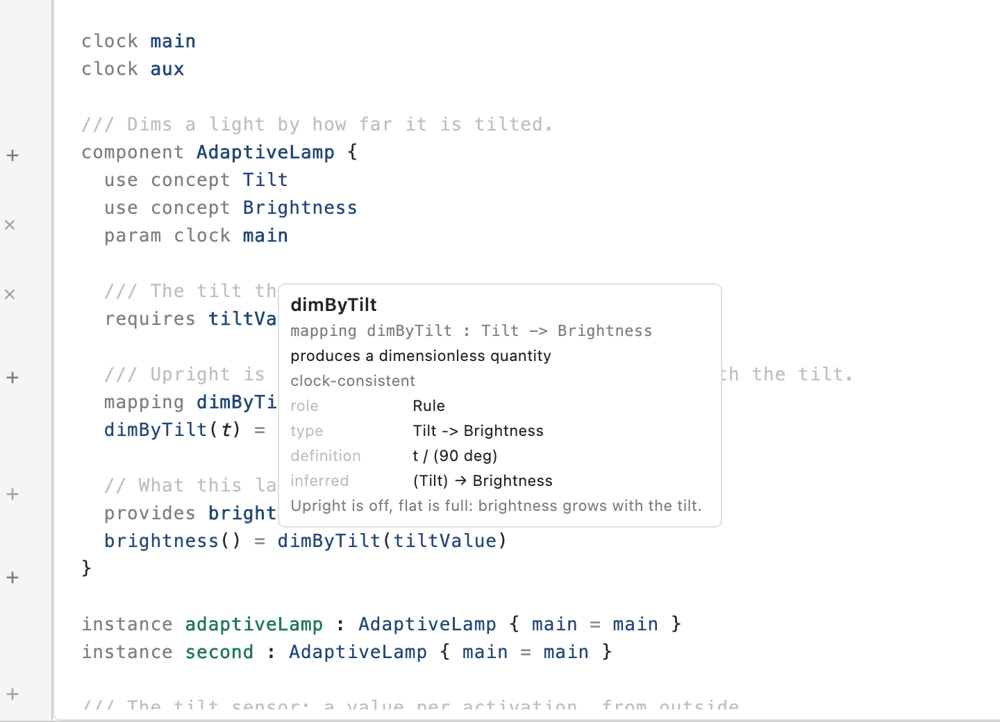

# Design, Code and Split

The Design page shows one project three ways. A control at the right end of the
bar above the canvas switches between them:

| View       | What you see                                    | What you do                                                    |
| ---------- | ----------------------------------------------- | -------------------------------------------------------------- |
| **Design** | the canvas ([Canvas](canvas.md))                | draw the design                                                |
| **Code**   | the project's `.bdl` files in an editor         | type the design ([Syntax basics](../textual/syntax-basics.md)) |
| **Split**  | the canvas on the left, the editor on the right | both, on the same objects                                      |

Switching changes nothing in the project: the graph and the text are two
pictures of the same design, kept in step by Studio's compiler service. There is
no _convert_, _import_ or _export_.

## What the editor shows

The text of one file at a time. When the project has several `.bdl` files, a
pop-up at the top of the editor names them; a file that does not build yet is
listed with _— not built_.

The text is the project's files with everything you did on the canvas written
in: rename a concept on the canvas and the text shows the new name at every
place it is used, with your comments and blank lines untouched. Add a
relationship on the canvas and it appears at the end of `src/main.bdl` (or of
the first file, when there is no `main.bdl`), or at the end of the component
body it belongs to.

## What the colours mean

_The Code view of the component system: the file as the project holds it,
coloured by what each word is._

The text is coloured by what each word _is_ to the project — not by how it is
spelled. The colours are the canvas's: a **concept** name has the concept nodes'
blue-grey, a **relationship** the relationship nodes' blue, a **Source** the
green of a Source node, an **output** or a **device** the warm tone of an output
node, an **instance** the teal of an instance node. Keywords, operators and
units are grey; comments lighter grey. A name where it is _declared_ is heavier
than where it is used; a name that exists only inside a formula — a rule's
parameter, a binder's variable — is italic; a `?` left in a formula is orange,
the same _still to decide_ colour as elsewhere.

Because the colours come from the project, they tell you things spelling cannot:
`deg` after `90` is a unit, `deg` as a rule's parameter is not; `all` at the
head of `all x in xs: …` is a keyword, a value named `all` is a value; `clamp`
is the library's; a relationship turns from Source green to relationship blue
the moment it is given a definition. A file that does not build yet keeps its
keywords, numbers, comments and units coloured, and the names the last version
that built still knows. The colours follow the appearance (light or dark); there
is no setting.

## Typing

Type as in any editor. A short moment after you stop, the file is read as a
design:

- **It builds.** The canvas changes to match — a new relationship appears as a
  node, placed for you beside what it reads; a renamed concept keeps its node,
  its colour, its place and its connections, because the identity of an item
  lives with its kind and name, not with its spelling in the text
  ([Identity](../textual/overview.md#identity)).
- **It does not build yet.** A banner above the editor says _This file does not
  build yet: the design shows the last version that did._ The canvas keeps
  showing the last version of the file that built, with its own banner: _Showing
  the last version that built; the text has changes that do not build yet._ Your
  text stays exactly as typed. The reasons are listed under the editor, one per
  line, with the line number; click one to put the cursor on it. An **×** is
  something the design cannot mean; a **hollow ring** is something the design
  has no meaning for yet and does not stop the file from building. Fix the text
  and both banners go.

Nothing you type is lost, and nothing you drew is lost: a file that does not
build never erases the graph.

**Undo** (⌘Z) undoes changes to the design — a relationship added in the text is
undone like one added on the canvas, and the text follows. Changes that only
touch comments or spacing are not steps of that history.

## Split: one selection

Select a node on the canvas and the editor scrolls to its declaration. Click
inside an item's text and its node is selected on the canvas, so the inspector
shows it. The selection is the same object in both views.

## Saving

**⌘S** writes the files exactly as the editor shows them — a file that does not
build yet included — then the layout and the sidecars
([Project files](../reference/project-files.md)). Reopening the project shows
the same text, with the same banners, and the design as the last version that
built.

## What the editor knows

The editor asks Studio's compiler service the same questions a code editor with
the [language server](../textual/editor-and-lsp.md) asks, about the text exactly
as you have typed it.

**Completion.** Press **⌃Space** and a list opens at the cursor with what can go
here, best first: after a `:` the concepts, after an `@` the timing domains, at
the start of a line the items allowed there, and inside a formula the inputs,
the other relationships — a rule offered as a call, a Source or a value as its
name — the names bound in the formula itself, the equations of the library, and
after a number the units. ↑ and ↓ move, **Return** or **Tab** accept, **Esc**
closes; the list narrows as you type. What is inserted is the service's text,
never a guess.

_The completion pop-up inside the component's body, after `dimByTilt(`: what can
go here, from the compiler service, best first._

**Hover.** Rest the pointer on a name and a card says what it is: its
declaration, what it produces, its state, its role (_Source_, _Rule_ or
_Value_), the description you wrote. On an equation of the library — `clamp`,
`min`, `any` — the card gives its shape and what it does. Over a keyword, a
number or a unit there is no card. Typing or moving away hides it.

_The hover card over `dimByTilt` where the component's body applies it: its
declaration, its role, its state._

**Go to definition.** **⌘-click** a name, or put the cursor on it and press
**F12**, and the editor selects where it is declared — in this file or in
another, which opens. Inside a component's source a port's name leads to the
port's line, never to an instance's copy.

**References.** **⇧F12** on a name lists, under the editor, every place that
names it, across all files, with the file and line; a row takes you there. Esc
or the × closes the list. Two concepts with the same value form never share a
list: the search is by identity, not by spelling.

**Format.** **⌥⇧F**, or _Format_ at the right of the file bar, lays the file out
the canonical way — spacing, indentation, one blank line between items — and
applies it as one edit, with the cursor kept on its line. A file that does not
parse yet is left exactly as it is; fix it first.

Everything here works on the text as it stands, whether or not it builds: what
the last version that built still knows is answered, and what nothing resolves
gets no card and no destination, never a guess by spelling.

## Not built yet

Findings underlined in the text (the list and the cursor jump stand in); rename
from the editor (rename on the canvas, and the text follows); creating a second
source file from Studio (make it in a code editor; it appears on reload).

## Related

[Canvas](canvas.md) · [Textual BDL](../textual/overview.md) ·
[Authoring a project as text](../workflows/authoring-as-text.md) ·
[Source files](../troubleshooting/text-project-errors.md)
