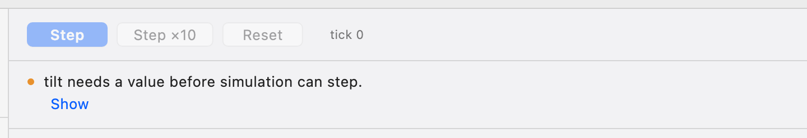

# Simulate

The Simulate page (⌘2) answers _what does the design do over time_, one tick at
a time. Every value comes from the compiler service's reference evaluator — the
executable definition of what a BDL design means. Studio holds the inputs you
typed, the periods you chose and the samples that came back; it computes nothing
itself.

![The Simulate page: on the left, under Sources, a control for tilt showing 0.785398 rad and the interaction domain's period of every 1 ticks; in the middle the Step, Step ×10 and Reset buttons, tick 3, and a trace with three rows whose tilt, brightness and light columns read Tilt(0.785398 [rad]), Brightness(0.5) and Brightness(0.5); on the right the probe for brightness with Brightness(0.5) now and at each tick over the run.](../assets/studio/simulate-page.png)

_The Simulate page after three steps with the tilt at 45°: the Sources on the
left, the trace in the middle, the probe on the right._

## Sources (left)

One control for every [Source](canvas.md) — every relationship that reads
nothing and has no formula: the values the environment provides, which the
simulation asks you for. The control follows the concept's value form, never its
name: a number with the unit beside it for a quantity (in the base unit:
radians, metres, seconds, kelvin…), a switch for on / off, a whole number for a
count. The row carries the concept's glyph and colour, and clicking it selects
the object — on this page and on Design.

Under the Sources, **Timing domains**: a period per domain — _every N_ ticks —
the schedule the evaluator activates by. A period, never a rate. Changing a
period starts the run over.

An instance's **open required ports** are Sources too, and an instance's values
are listed as `lampA.brightness`.

## Readiness (above the trace)

Before anything runs, the page lists what would stop a step, as sentences about
named objects, each with a _Show_ link that selects it:

- _tilt needs a value before simulation can step._ — a Source without a value
- _Tilt needs a value form (Quantity, On / off or Count) before tilt can be
  given a value._ — a concept still on _decide later_
- _dimByTilt has no definition._ / _level has no valid definition._
- _These relationships depend on each other in the same instant: a, b._

While any is listed **Step** is disabled and does nothing. While the analysis
for the current design has not arrived the list says _Checking the design…_ and
nothing is wrong. Opening the page never starts a run.

_A blocker with its Show link: the Source tilt has no value yet, so Step is
disabled._

## Step, Step ×10, Reset

**Step** evaluates the next tick with the Sources on screen; **Step ×10** ten of
them. Every step is a **replay**: the evaluator restarts at tick 0 with every
tick's Sources so far and the schedule, then runs to the new tick — so the same
design, Sources and periods always give the same trace. **Reset** returns to
tick 0; Sources and periods stay.

A tick that **fails** — a division by zero, a value that is not a number — stops
there, and the failure is written on the controls' line about the object (_bad
divided by zero._), never as a banner.

## The trace (centre)

Rows are ticks. Columns are the design's **values** — relationships without
inputs — and its **driven outputs**; a rule (a relationship with inputs) has no
column, because it is a function, not a value. The _active_ column names the
domains that ticked. A cell is the evaluator's own rendering, always with the
concept and in the value form's words: `Brightness(0.5)`,
`Tilt(0.785398 [rad])`, `Held(on)` — a truth value reads _on_ / _off_, a number
shows six significant digits. Studio never renders a value itself.

An empty cell means the value's domain did not activate at that tick. A Source's
cell is the value you fed, echoed by the evaluator at the ticks its domain
activated. Column order is by identity, not by time; click a column header to
select that relationship.

Memory and transports show up as values: `acc = delay(0, acc + x)` reads `0` at
tick 0 and last tick's sum after; `y = sync(fast, -1, x)` in a slower domain
reads the source's last activation strictly before its own, so a source value
produced at the same instant is not yet visible.

## The probe (right)

The selected object's value **now** and **over the run**, written as in the
trace, with its glyph; for an output, its driver. A concept is shown as what
**carries** it — _Carried by_, then each value and Source that produces it with
its latest sample; when none does, _Nothing carries Brightness yet: no value or
Source produces it._ and, for each rule that produces it, _dimByTilt is a rule;
a value whose formula applies it would carry Brightness._ A rule has no value to
show: _A rule: it has no value of its own. A value whose formula applies it is
what the simulator samples._, then _Applied in brightness._ or _No value applies
it yet._ **Explain** under it holds the identity number, the run's revision and,
for a failure, the code and technical text.

## What a new revision does

Editing the design drops the samples and any answer still in flight, keeps the
fed values for inputs that still exist, and re-checks readiness. A trace always
belongs to one revision of the design.

## Not on this page

Values on the canvas (the trace and probe are the only views), plots (the trace
is a table), and telemetry from a real device (that is Monitor, which does not
exist yet).

## Related

[Your first simulation](../getting-started/first-simulation.md) ·
[Timing](../concepts/timing.md) ·
[Troubleshooting: incomplete design](../troubleshooting/incomplete-design.md)
