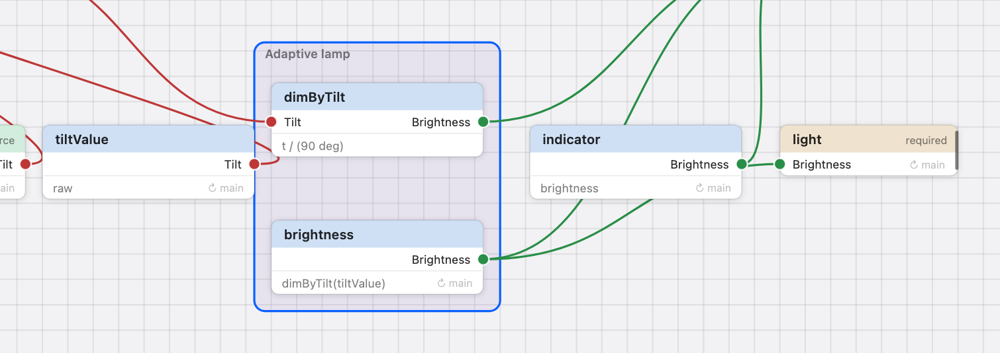

# Grouping a behavior

**Goal.** Gather the lamp's dimming relationships into one named behavior,
_Adaptive lamp_, and see the design from a step back — without changing what it
does.

**Needs** a project with a few relationships — the lamp of
[Your first behavior](../getting-started/first-behavior.md) — or the system
built in the [tests](../VERIFICATION.md): `raw` → `tiltValue` → `dimByTilt` →
`brightness` → `light`, with `indicator = brightness`.

## Steps

1. **Select the members.** ⇧-drag a box around `dimByTilt` and `brightness` on
   the canvas. The inspector shows _2 selected_ and **Group 2 relationships as
   Behavior**, with a note that they read each other.
2. **Group.** Click it (or right-click → **Group as Behavior**). A region named
   _Behavior_ surrounds the two nodes and its name opens for editing: type
   `Adaptive lamp`, Return.
3. **Look at the boundary.** Select the region. The **Boundary** section lists
   _Inputs: tiltValue_ (what the members read from outside), _Outputs:
   brightness_ (what outside reads), _Physical outputs: light_ (driven by a
   member), _Internal: dimByTilt_. You did not choose any of this; it is read
   off the dependencies.

   

   _The expanded behavior Adaptive lamp: a region around dimByTilt and
   brightness, selected._

4. **Collapse.** Right-click the region → **Collapse**. The two nodes become one
   box with a socket _tiltValue_ on the left and _brightness_ on the right; the
   links that entered and left the members now enter and leave the box. Zoom
   out: below half size every behavior reads as its box anyway.

   

   _The same behavior collapsed: one box with an aggregate socket for the member
   each link reaches._

5. **Notice what the box's sockets are.** Each is labelled with the member it
   stands for. A link dragged from or onto one resolves to that member — the box
   itself is never an end of a link.
6. **Expand**, drag `indicator` into the region: it joins. Drag it out onto
   empty canvas: it leaves. Right-click `indicator` → **Add to Group ▸** does
   the same.
7. **Check nothing changed.** ⌘2, Step a few ticks: the trace is the one you
   had, and a run that was already there is kept. A group edit is not a design
   change: the analysis is not redone and the status line does not move.

## What BDL means by this

- A behavior is **authoring metadata**: a name and a membership list. The
  compiler never reads it. Every value, every verdict, the simulation and the
  placement are those of the ungrouped design.
- The box's sockets are the **boundary as computed**: crossing-in and
  crossing-out dependencies. They are a picture. A link cannot attach to them,
  so nothing can ever depend on "the group".
- Undo (⌘Z) covers group edits, in one history with the design edits; undoing
  one changes no revision.

## If it does not work

- A banner refuses adding a relationship — it is already in another behavior; a
  relationship belongs to at most one.
- The **Boundary** section says _Computed once the analysis arrives._ — wait a
  moment, or fix a formula the compiler could not check.

## Next

[Packaging a behavior as a component](package-as-component.md).
